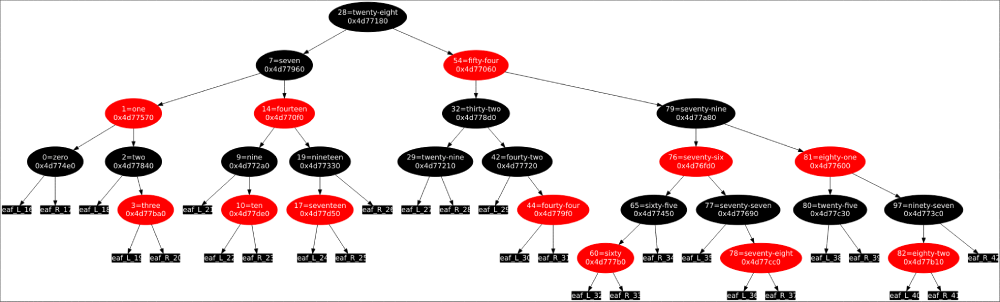

# ft_containers

`ft_containers` is a school project of 42.

42 is a private, non-profit and tuition-free Computer Science school based on peer-to-peer learning and hands-on projects.

> Implementation of the containers in C++.

This is a school exercise about research. Don't use it since it is not suitable at all for production.

## Requirements

This program was developed on Debian Linux. It runs on Debian and Ubuntu.

## Testing

Own tests:

```console
$ make && make debug
```

Test and draw Red-Black Tree (used for map and set):

```console
$ make debug_tree && make test_tree
```

<p align="center">
  
</p>

External tests:

- [A complete basic tester](https://github.com/mli42/containers_test)
- [An unpredictible fuzzing tester (harder to pass)](https://github.com/jgiron42/ft_containers_monkey_tester)

## Acknowledgements

School project done at [42 Paris](https://www.42.fr).

## License

See `LICENSE` for more information.
